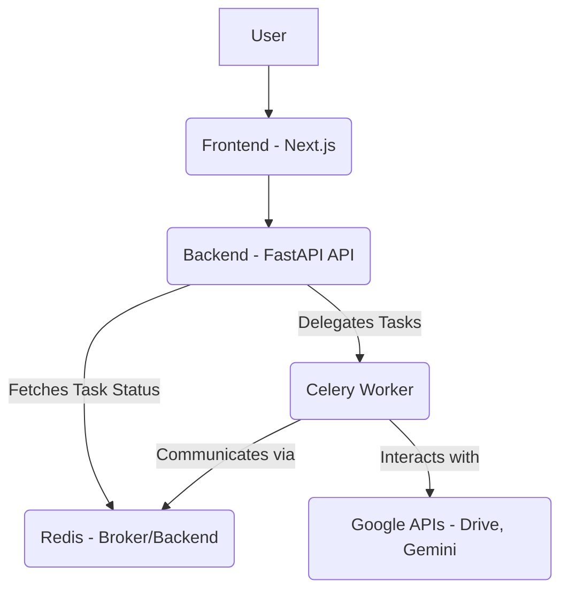

# Automated Sales Prospect Research Tool

A comprehensive tool designed to automate the process of sales prospect research, leveraging Google APIs, Gemini AI, and web crawling to gather and organize critical business intelligence.

## Table of Contents

*   [Features](#features)
*   [Technology Stack](#technology-stack)
*   [Architecture Overview](#architecture-overview)
*   [Setup & Installation](#setup--installation)
    *   [Prerequisites](#prerequisites)
    *   [Clone Repository](#clone-repository)
    *   [Environment Variables](#environment-variables)
    *   [Running with Docker Compose (Recommended)](#running-with-docker-compose-recommended)
    *   [Running Locally (for development)](#running-locally-for-development)
*   [Usage](#usage)
*   [Troubleshooting](#troubleshooting)
*   [Contributing](#contributing)
*   [License](#license)

## Features

*   **Google Login:** Secure authentication via Google OAuth.
*   **Google Drive Integration:** Create folders and save research reports directly to Google Drive.
*   **Gemini Research:** Utilize Gemini AI for in-depth prospect analysis, including:
    *   Prospect Deep Dive
    *   Prospect Overview
    *   Competitor Analysis
    *   Own Competitor Marketing Analysis
*   **URL Crawling:** Extract content from specified URLs using Trafilatura.
*   **Automated Workflow:** Orchestrate research tasks using Celery and Redis.
*   **User-friendly Interface:** A responsive frontend built with Next.js.

## Technology Stack

*   **Frontend:** Next.js, React, TypeScript, Tailwind CSS
*   **Backend:** FastAPI, Python
*   **Database:** (Not explicitly defined in tasks, assuming file-based or in-memory for now, or external if integrated later)
*   **Task Queue:** Celery, Redis
*   **Containerization:** Docker, Docker Compose

## Architecture Overview

The application follows a client-server architecture with asynchronous task processing:

*   **Frontend (Next.js):** Serves the user interface, handles user input, and communicates with the Backend API.
*   **Backend (FastAPI):** Provides RESTful APIs for authentication, research initiation, and status updates. It acts as an orchestrator, delegating long-running tasks to Celery workers.
*   **Celery:** A distributed task queue that processes CPU-intensive and time-consuming tasks (e.g., Gemini AI calls, URL crawling, Google Drive operations) asynchronously.
*   **Redis:** Serves as the message broker for Celery, facilitating communication between the FastAPI app and Celery workers, and also as a result backend for task states.
*   **Google APIs:** Utilized by the Backend and Celery workers for Google OAuth, Google Drive interactions, and Gemini AI.



## Setup & Installation

### Prerequisites

Ensure you have the following software installed on your system:

*   [Docker](https://docs.docker.com/get-docker/)
*   [Docker Compose](https://docs.docker.com/compose/install/)
*   [Node.js](https://nodejs.org/en/download/) (LTS version recommended)
*   [Python 3.9+](https://www.python.org/downloads/)
*   [Git](https://git-scm.com/downloads)

### Clone Repository

```bash
git clone https://github.com/your-username/sales-researcher.git
cd sales-researcher
```

### Environment Variables

This project uses environment variables for sensitive information and configuration. You need to set these up for both the `frontend` and `backend` services.

1.  **Copy `.env.example` files:**
    ```bash
    cp frontend/.env.example frontend/.env
    cp backend/.env.example backend/.env
    ```
2.  **Populate `.env` files:**
    Edit the newly created `.env` files and fill in the required values.
    *   **`frontend/.env`:**
        *   `NEXT_PUBLIC_GOOGLE_CLIENT_ID`: Your Google OAuth Client ID.
        *   `NEXT_PUBLIC_BACKEND_URL`: Typically `http://localhost:8000` when running locally or with Docker Compose.
    *   **`backend/.env`:**
        *   `GOOGLE_CLIENT_ID`: Your Google OAuth Client ID.
        *   `GOOGLE_CLIENT_SECRET`: Your Google OAuth Client Secret.
        *   `GOOGLE_REDIRECT_URI`: The redirect URI configured in your Google Cloud Project (e.g., `http://localhost:8000/auth/google/callback`).
        *   `GEMINI_API_KEY`: Your Google Gemini API Key.
        *   `REDIS_URL`: `redis://redis:6379/0` when using Docker Compose, or `redis://localhost:6379/0` for local Redis.
        *   `SECRET_KEY`: A strong, random string for JWT token signing.
        *   `ALGORITHM`: `HS256` (default for JWT).
        *   `ACCESS_TOKEN_EXPIRE_MINUTES`: Expiration time for access tokens (e.g., `30`).

    **Where to get these values:**
    *   **Google OAuth Credentials (`GOOGLE_CLIENT_ID`, `GOOGLE_CLIENT_SECRET`, `GOOGLE_REDIRECT_URI`):** Obtain these from the [Google Cloud Console](https://console.cloud.google.com/). Create an OAuth 2.0 Client ID (Web application type) and configure the authorized redirect URIs.
    *   **Gemini API Key (`GEMINI_API_KEY`):** Get this from the [Google AI Studio](https://aistudio.google.com/app/apikey) or Google Cloud Console.

    **Security Note:** Never commit your `.env` files to version control. They contain sensitive information. `.gitignore` files are already configured to ignore them.

### Running with Docker Compose (Recommended)

This is the easiest way to get the entire application stack running.

1.  **Build Docker images:**
    ```bash
    docker-compose build
    ```
    *(Note: If you encounter issues with Docker builds, please inform the user as there might be a problem with the terminal and Docker build commands.)*
2.  **Start the services:**
    ```bash
    docker-compose up
    ```
    This will start the Frontend, Backend, Redis, and Celery worker services.
3.  **Access the application:**
    *   **Frontend:** `http://localhost:3000`
    *   **Backend API:** `http://localhost:8000` (for API endpoints, not a UI)

### Running Locally (for development)

This method is suitable for developers who want to work on specific parts of the application without Docker.

#### Backend

1.  **Navigate to the backend directory:**
    ```bash
    cd backend
    ```
2.  **Create and activate a Python virtual environment:**
    ```bash
    python -m venv venv
    source venv/bin/activate  # On Windows: .\venv\Scripts\activate
    ```
3.  **Install dependencies:**
    ```bash
    pip install -r requirements.txt
    ```
4.  **Run the FastAPI application:**
    ```bash
    uvicorn main:app --reload
    ```
    The backend will be accessible at `http://localhost:8000`.

#### Frontend

1.  **Navigate to the frontend directory:**
    ```bash
    cd frontend
    ```
2.  **Install Node.js dependencies:**
    ```bash
    npm install
    # or yarn install
    ```
3.  **Run the Next.js development server:**
    ```bash
    npm run dev
    # or yarn dev
    ```
    The frontend will be accessible at `http://localhost:3000`.

#### Redis

You need a running Redis instance for the Celery worker. You can run it via Docker:

```bash
docker run --name my-redis -p 6379:6379 redis:alpine
```

#### Celery Worker

1.  **Ensure Redis is running and the backend virtual environment is activated.**
2.  **Navigate to the backend directory:**
    ```bash
    cd backend
    ```
3.  **Start the Celery worker:**
    ```bash
    celery -A celery_app worker -l info
    ```

## Usage

1.  **Access the Frontend:** Open your web browser and navigate to `http://localhost:3000`.
2.  **Login:** Use the Google Login button to authenticate with your Google account.
3.  **Enter Company Name:** On the main interface, input the name of the company you wish to research.
4.  **Select Google Drive Folder:** Choose or create a Google Drive folder where the research reports will be saved.
5.  **Start Research:** Initiate the research process. Progress will be displayed on the UI.

## Troubleshooting

*   **Docker containers not starting:**
    *   Ensure Docker Desktop (or Docker daemon) is running.
    *   Check `docker-compose logs` for specific error messages.
    *   Verify port availability (3000, 8000, 6379).
    *   Ensure `.env` files are correctly configured and present in `frontend/` and `backend/`.
*   **API Key Errors (Google/Gemini):**
    *   Double-check that `GOOGLE_CLIENT_ID`, `GOOGLE_CLIENT_SECRET`, `GEMINI_API_KEY`, and `GOOGLE_REDIRECT_URI` are correctly set in your `.env` files.
    *   Ensure your Google Cloud Project has the necessary APIs enabled (e.g., Google Drive API, Gemini API).
*   **Frontend not connecting to Backend:**
    *   Verify `NEXT_PUBLIC_BACKEND_URL` in `frontend/.env` points to the correct backend address (e.g., `http://localhost:8000`).
    *   Check if the backend FastAPI application is running and accessible.
*   **Celery worker not processing tasks:**
    *   Ensure Redis is running and accessible from the Celery worker.
    *   Verify `REDIS_URL` in `backend/.env` is correct.
    *   Check Celery worker logs for errors.

## Contributing

Contributions are welcome! Please refer to the `CONTRIBUTING.md` (if available) for guidelines on how to contribute to this project.

## License

This project is licensed under the MIT License. See the `LICENSE` file for details.